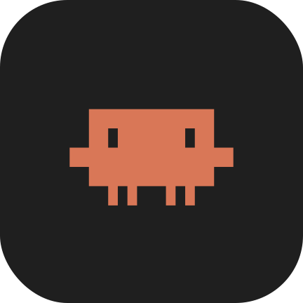

<div align="center">



# Claude Droid

**Claude Code на Android-телефоне с рутом.**

Терминал остаётся терминалом, а ввод — обычное поле Android:
курсор, выделение, стирание, диктовка, вставка.

</div>

---

## Что это

Приложение-клиент к настоящему `claude`, который живёт в Termux и работает от root — с полным
доступом ко всему телефону. Само приложение только рисует экран и шлёт ввод, поэтому сессии
не зависят от него: свернул или выгрузил Claude Droid — claude продолжает работать, а при
следующем запуске подхватывается тот же диалог.

- **Чаты** — шторка слева (свайп от края или ☰). Каждый чат — своя tmux-сессия поверх
  транскрипта claude: старые поднимаются через `--resume`, новые получают свой uuid.
  Свайп влево завершает сессию. Статусы: работает / ждёт выбора / ответ готов / живая.
- **Слэш-панель** — «/» в поле ввода открывает список команд: встроенные плюс скиллы
  из `~/.claude/skills` и `~/.claude/commands` с телефона. Тап отправляет, долгий тап вставляет.
- **Модель и усилия** — шит по кнопке в шапке, уходит в claude как `/model` и `/effort`.
- **Системный промпт** — приложение кладёт в `~/.claude/CLAUDE.md` инструкцию о том, что
  claude сидит рутом на самом телефоне: какие утилиты звать по `/system/bin`, чего не делать
  под root, что подтверждать. Файл перезаписывается при каждом старте — правь
  [`assets/CLAUDE.md`](assets/CLAUDE.md) и пересобирай, а своё держи в `CLAUDE.md` проекта.
- Long-press по терминалу копирует текст; в фоне опрос экрана останавливается, su-шелл
  переподключается сам.

## Что нужно

| | |
|---|---|
| Телефон | Android arm64 с root — [Magisk](https://topjohnwu.github.io/Magisk/install.html). Проверено на Pixel 10 Pro, Android 17 QPR1 Beta, Magisk 30.7 |
| Termux | [с GitHub или F-Droid](https://github.com/termux/termux-app/releases) — версия из Play Store не годится |
| Аккаунт | Claude Pro/Max либо API-ключ |

## Установка

Всё делается на самом телефоне — компьютер, adb и Android SDK не нужны, ОС на компе
не важна.

**1. Termux и root.** Поставь Termux, запусти его, открой Magisk → Superuser и разреши Termux root
(проще всего: набрать в Termux `su` — Magisk сам спросит).

**2. Claude Code в Termux.** Одна команда (набирать не обязательно — открой этот README
в браузере телефона и скопируй):

```bash
pkg install -y curl && curl -sSL https://raw.githubusercontent.com/kirillshsh/ClaudeDroid/main/setup-termux.sh | bash
```

Скрипт ставит `tmux` и `node`, кладёт musl-загрузчик из Alpine и musl-сборку claude, создаёт
обёртки `claude` / `claude-update` и Magisk-модуль с `/etc/resolv.conf`. Запускать можно повторно.

**3. Перезагрузи телефон** — Magisk-модуль монтируется только при загрузке, а без `/etc/resolv.conf`
musl-сборка claude молча виснет на первом же DNS-запросе.

**4. Войди в аккаунт.** В Termux: `claude`, затем `/login`. Здесь же ставятся плагины
и скиллы — приложение подхватит их в слэш-панель.

**5. Поставь приложение.** Скачай APK со [страницы релизов](https://github.com/kirillshsh/ClaudeDroid/releases)
прямо в браузере телефона и открой файл; Android спросит разрешение на установку из этого
браузера. Потом Magisk → Superuser → выдать root **Claude Droid**.

Всё. Открывай приложение — оно поднимет claude само.

<details>
<summary>Обновлять claude</summary>

```bash
claude-update           # последняя версия
claude-update 2.1.247   # конкретная
```

Автообновление у musl-сборки не работает и в `settings.json` выключено (`DISABLE_AUTOUPDATER`).
</details>

## Как устроено

```
Claude Droid (Java, uid приложения)
      │  su -M  →  один долгоживущий root-шелл
      ▼
tmux-сессии «cc_<uuid8>»  ──  claude (musl-сборка) в Termux-окружении
      │
      ├─ вывод:  tmux capture-pane -p -e -S -800  (раз в 300 мс, разбор ANSI → SpannableString)
      ├─ ввод:   tmux set-buffer + paste-buffer (bracketed paste) → send-keys Enter
      └─ чаты:   ~/.claude/projects/<slug>/*.jsonl  (uuid, mtime, заголовок)
```

| | |
|---|---|
| [`MainActivity.java`](src/sh/kirill/claudedroid/MainActivity.java) | UI: терминал, шторка чатов, слэш-панель, шит модели |
| [`TmuxThread.java`](src/sh/kirill/claudedroid/TmuxThread.java) | root-шелл, tmux-сессии, опрос экрана, список чатов |
| [`Ansi.java`](src/sh/kirill/claudedroid/Ansi.java) | разбор ANSI SGR → SpannableString |
| [`assets/CLAUDE.md`](assets/CLAUDE.md) | системный промпт: claude знает, что он рутом на телефоне |
| [`setup-termux.sh`](setup-termux.sh) | установка claude на телефон |

## Сборка

Нужна, только если хочешь свою версию — для установки хватит APK из релизов.

Без Gradle: `aapt2` + `javac` + `d8` напрямую. Требуются Android SDK (build-tools и любая
platform), JDK 17+, `zip` и bash — то есть macOS, Linux или WSL/Git Bash на Windows.
Отладочный ключ создаётся сам, если его нет.

```bash
bash build.sh && adb install -r out/claudedroid.apk
```

<details>
<summary>Грабли, на которые ушло больше всего времени</summary>

- **`su` нужен с `-M`** (mount-master): Android прячет чужие `/data/data` в mount namespace
  приложения, и без глобального namespace даже root не видит бинарники Termux.
  Сам `su` у Magisk лежит в `/system_ext/bin/su`, которого нет в PATH приложения.
- **PATH в su-шелле** приходит из `mkshrc` и свой `export` его не переживает — всё зовём
  по абсолютным путям с `env …` перед ними.
- **Truecolor**: claude отдаёт 24-битный цвет, только когда в окружении нет `TMUX` /
  `TMUX_PANE` / `TERM_PROGRAM`. Иначе цвет падает до 256, и фирменный оранжевый `#D97757`
  становится коралловым `#D78787`. Лечится `env -u TMUX -u TMUX_PANE -u TERM_PROGRAM`.
- **Сокеты cross-session**: claude требует, чтобы каждый компонент пути был приватным (0700)
  и принадлежал ему или root. Под root в `/data` не подходит ничего (`/data` — `drwxrwx--x
  system system`), поэтому `CLAUDE_CODE_TMPDIR=/dev/claudedroid-run`.
- **Шрифт**: у Roboto Mono нет части блочной графики, и из-за подстановки рвался ASCII-маскот.
  Взят JetBrains Mono, плюс `setIncludeFontPadding(false)` и `setLineSpacing(0, 1f)` — иначе
  блоки не стыкуются. Глифов `⏵⏸⏺` нет ни в шрифте, ни в системном фолбэке: парсер меняет
  их на `▶‖●`.
- **Фокус — только у поля ввода**: `setTextIsSelectable(true)` на терминале крадёт IME-фокус
  (печать уходит в никуда), focusable-скроллы и кнопки перехватывают его при перестройке
  layout — всем виджетам, кроме `EditText`, выставлен `setFocusable(false)`.
- **Высота tmux-пейна** считается от максимального виденного вьюпорта: если ресайзить под
  клавиатуру, каждый resize перерисовывает TUI и вымывает scrollback.
- `capture-pane` — без `-J`: склейка обёрнутых строк ломает построчную сетку экрана.

</details>

## Лицензия

Шрифт — [SIL Open Font License 1.1](https://github.com/JetBrains/JetBrainsMono/blob/master/OFL.txt)
(JetBrains Mono). Остальное — делай что хочешь.
